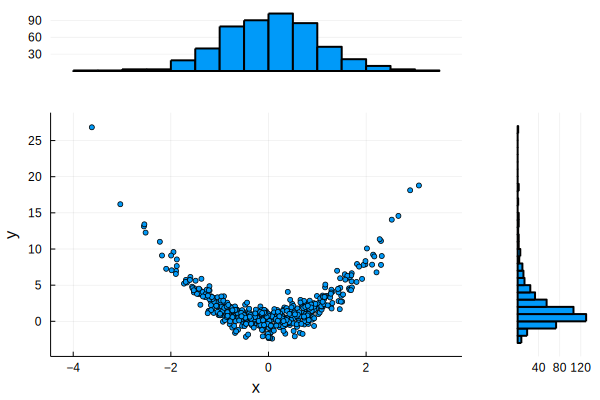

# Suggested exercises

1. Find the sum of all the positive integers less than 1000 that are multiples of 3 or 5.

2. A *Collatz sequence* starting at integer $x_0$ is defined recursively by $x_k = f(x_{k-1})$, where

$$
f(n) = \begin{cases} 
n/2, & \text{if $n$ is even,} \\ 3n+1, & \text{if $n$ is odd.} 
\end{cases}
$$
It is believed, but not proved, that the Collatz sequence has finite length for every starting integer. Determine the value of $x_0 < 200$ that gives the longest Collatz sequence.

3. You know the Maclaurin series for the exponential function,

$$
e^x = 1 + x + \frac{x^2}{2} + \cdots + \frac{x^n}{n!} + \cdots. 
$$

Set $x=10.0$ and use a loop to evaluate this series naively, stopping when you reach a term that is too small to change the result. Then repeat for $x$ equal to `10f0`, which gives a 32-bit result, and $x$ equal to `BigFloat(10)`, which gives a 256-bit result.

4. Define a *random walk* as the sequence $x_0=0$, $x_k = x_{k-1} \pm 1$, where the $+$ and $-$ signs are chosen independently and with equal probability at each $k$. It is easy to prove the expected values

$$
E[x_n] = 0, \qquad E\bigl[x_n^2\bigr] = n,
$$

and not at all easy to prove that 

$$
E\bigl[\left|x_n\right|\bigr] = \sqrt{\frac{2n}{\pi}}. 
$$

Perform a random walk with $n=100,000$ and verify that these expected values are approximately obtained.

5. Write a function `newton(f,df,x₁)` that performs the Newton iteration for rootfinding,

$$
x_{k+1} = x_k - \frac{f(x_k)}{f'(x_k)},
$$

starting with $x_1=$`x₁`. Return the entire sequence as a vector. You can decide how to make the iteration stop: based on a fixed number of iterations, or when $|x_{k+1}-x_k|$ is sufficiently small, for example.

6. Write a function `trapezoid(f,interval,n)` that applies the trapezoid formula for numerical integration,

$$
\int_a^b f(x)\, dx \approx \frac{h}{2} \left[ f(x_0) + 2f(x_1) + \cdots + 2f(x_{n-1}) + f(x_n)\right], 
$$

where $a$ and $b$ are the entries of the vector `interval` and $h=(b-a)/n$.

7. (Continuation of 6) Write another method `trapezoid(y,a,b)`, where `y` is a vector and the numbers `a` and `b` define the endpoints of the integration interval. The vector $y$ has length $n+1$ and represents the values $f(x_i)$ in the trapezoid formula.

8. How closely can you reproduce this plot?

The data vectors are `x = randn(500); y = 2x.^2 + randn(500);` You will need to look at help for [Layouts](https://docs.juliaplots.org/latest/layouts) and [Attributes](https://docs.juliaplots.org/latest/attributes/).

9. Try Exercises 3, 4, 6 from [this section](https://tobydriscoll.net/fnc-julia/linsys/lu.html#exercises) or 4 and 5 from [this section](https://tobydriscoll.net/fnc-julia/linsys/structure.html).
