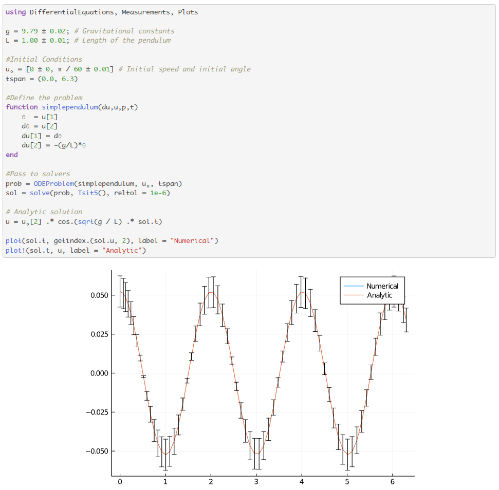

# Why Julia?
Bezanson, Karpinski, Shah, Edelman: [Why we created Julia](https://julialang.org/blog/2012/02/why-we-created-julia/)

* Scientific computing foremost
* Free and open
* Modern language features
* Speed
* Composition of packages
* Parallel/distributed/GPU computing
* Interoperability

---
<!-- _class: centered -->

---
<!-- _class: centered -->

| |  Julia |  Matlab  | Python  |
|--|:------:|:----------:|:---------:|
| Open  | :thumbsup: |  :thumbsdown:  |  :thumbsup:  |
| Reproducible  |  :smiley:  |  :unamused: | :grimacing:  | 
| Simple syntax | :worried: | :grin:  | :wink:  |
| Powerful syntax | :satisfied:   | :cry: | :relieved:|
| Execution speed | :sunglasses: | :neutral_face: |  :scream:  |
| Interactive speed  | :disappointed:  | :laughing: |  :smile:  |
| Ecosystem | :construction_worker: | :moneybag: | :joy:  |

--- 

# Ways to use Julia

<!-- _class: centered -->

| |  VSCode |  Jupyter  |  Pluto  |
|--|:------:|:----------:|:---------:|
| Interactive  | :heavy_check_mark: | :heavy_check_mark: | :heavy_check_mark:  |
| Shareable output  |   | :heavy_check_mark: | :heavy_check_mark:  |
| Reusable code/packages  | :heavy_check_mark: |   | | 
